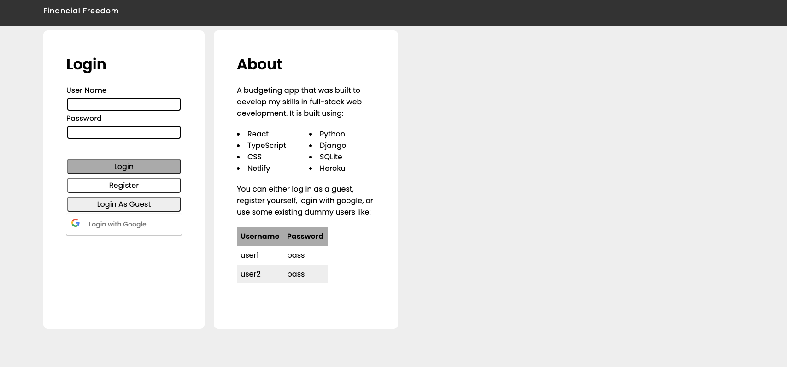
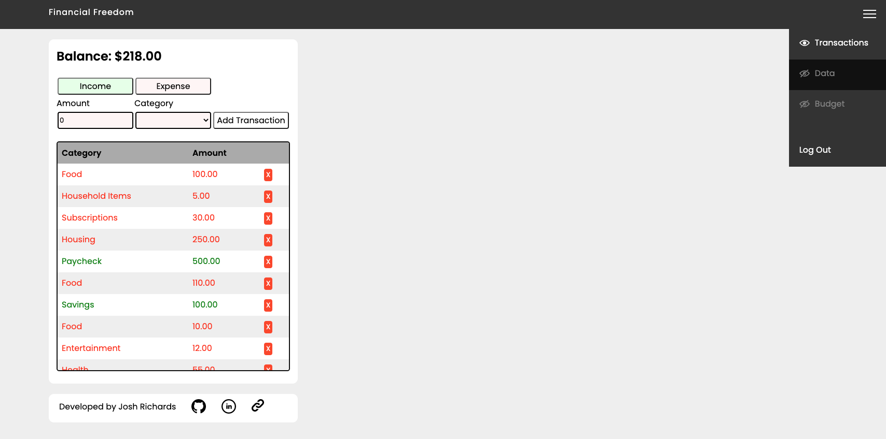
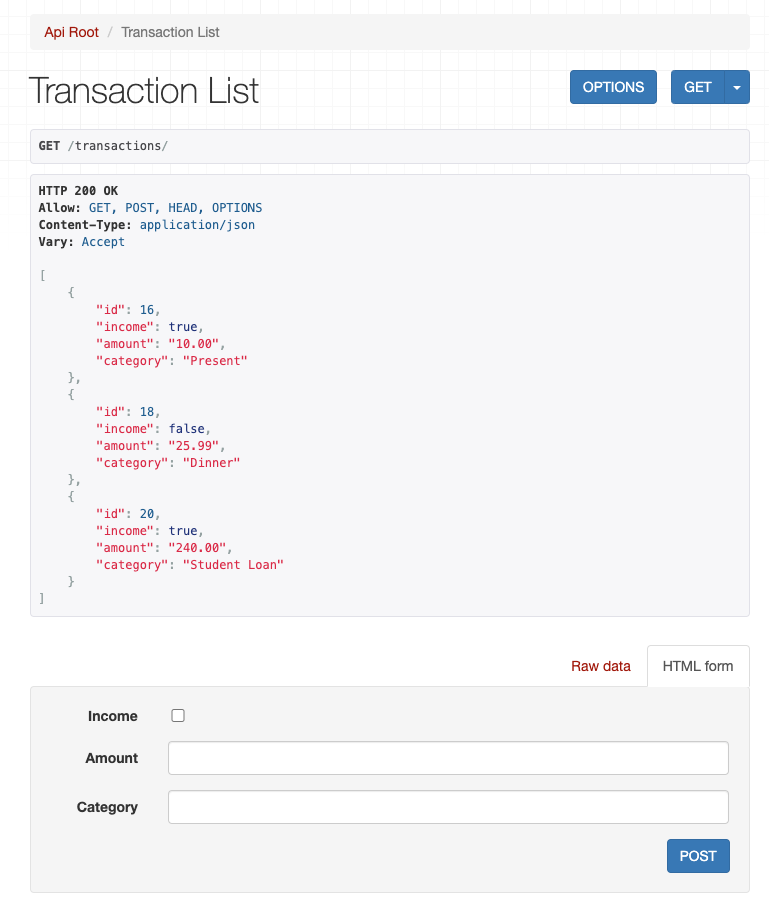

# Financial Freedom

[Check out the project live here!](https://financial-freedom.netlify.app/)

A full stack budgeting application that manages users and their transactions.

## Technologies

- **React** (for the frontend framework)
- **Typescript** (for the Javascript syntax)
- **CSS** (for the styling)
- **Python** (for the server side language)
- **Django** (for the server side framework)
- **SQLite** (for the database)

## Current Functionality

- Adding a transaction
- Deleting a transaction
- Showing your balance
- Pie Charts that show
  - Income vs Expenses
  - Expense Category Comparison
- A budget of what you want to spend on each category
- Hot swap sections to customise the user interface
- User support with login, logout and register functionality
- Storing users tokens locally to remove the need to login every time
- Can sign in using your Google Account

I will continue to expand the functionality in the future.

## Set-up on your Machine

1. Clone the project to your machine ```[git clone https://github.com/joshuarichards001/budgeting-web-app.git]```
2. Navigate into the diretory ```[cd budgeting-web-app]```
3. Source the virtual environment ```[pipenv shell]```
4. Install the dependencies ```[pipenv install]```
5. Navigate into the frontend directory ```[cd frontend]```
6. Install the dependencies ```[npm install]```

Then to run this application you will need to perform the following in two separate terminals:

1. In the first terminal go into backend ```[cd backend]``` and run ```[python3 manage.py runserver]```
2. In the second terminal go into frontend ```[cd frontend]``` and run ```[npm start]```

## Application in Action

Here is the login page that a new user is greeted with.


Here is the dashboard that is the core page of the application


A showcase of the "Hot swap sections" functionality


A showcase of the django API

